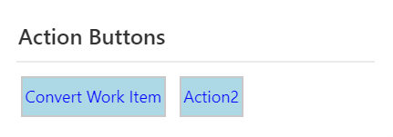
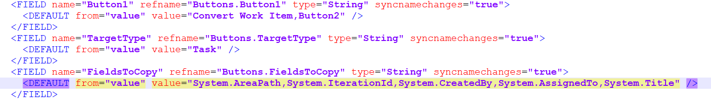
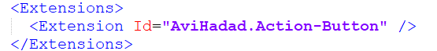
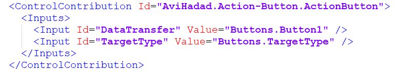
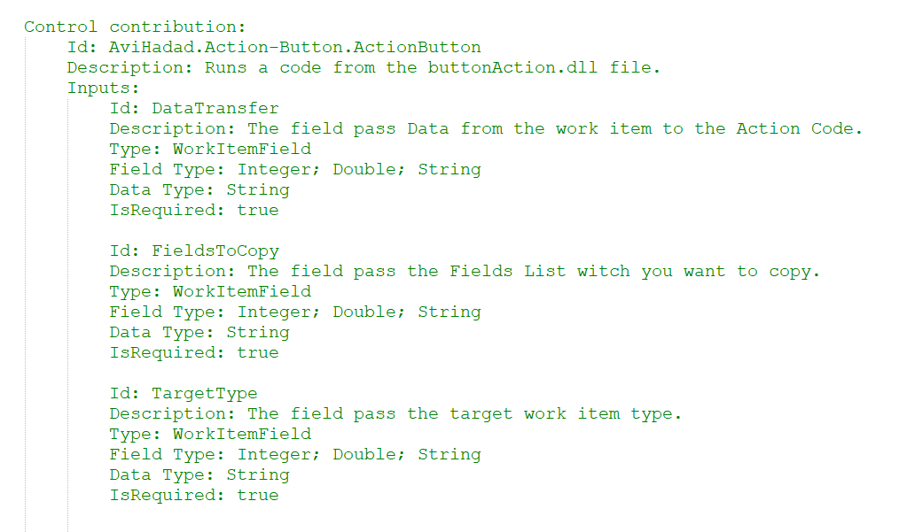

# Make Azure DevOps more interactive

# Triger an Action with a single click

Right now there is only one action, the 'convert work item', it copy the work item Basic fields to new and difrent work item

# How to get started

After instaling this extension, download the work item xml.
And add to fields, one for the buttons (can add several), second for the target type.

Add the Extenshion to the Layout.

Last step, Just add the controler to the layout.

you can get the data from this place

[Learn more](https://github.com/avih75/TFS_Action_Button.git/README.md) 
about how to customize the control, and add more actions.

# Source code 

The [source](https://github.com/avih75/TFS_Action_Button.git) 
this extension can be found on Github - feel free to take, fork and extend. 

You can also learn how to build your own custom control extension for the work item form [here](https://www.visualstudio.com/en-us/docs/integrate/extensions/develop/custom-control). 

# Feedback 

* You can mail me for any Help.
* I need your feedback! 
* Add a review below.
* Report issues in [GitHub](https://github.com/avih75/TFS_Action_Button.git).

> Microsoft DevLabs is an outlet for experiments from Microsoft, experiments that represent some of the latest ideas around developer tools. Solutions in this category are designed for broad usage, and you are encouraged to use and provide feedback on them; however, these extensions are not supported nor are any commitments made as to their longevity.
