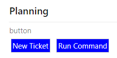
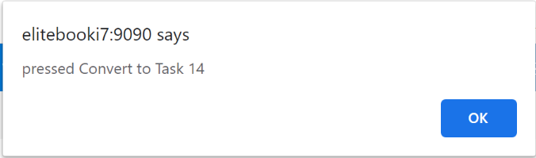
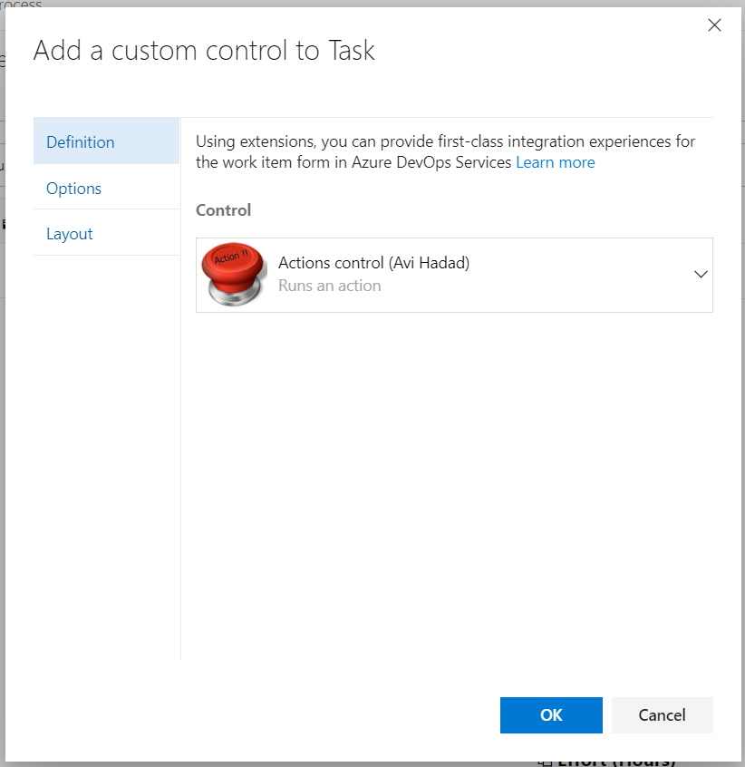
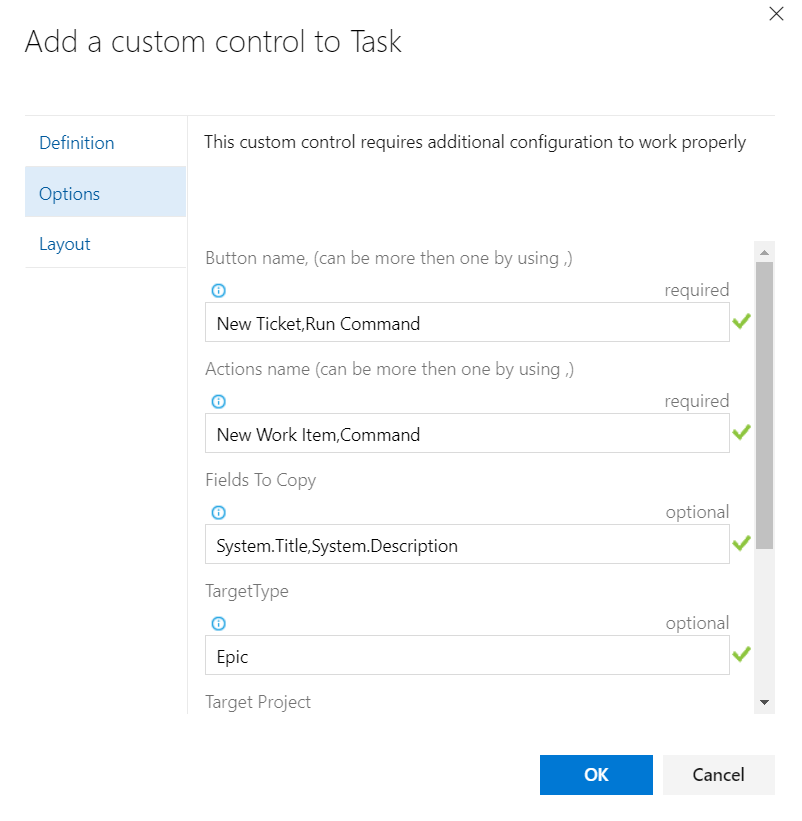
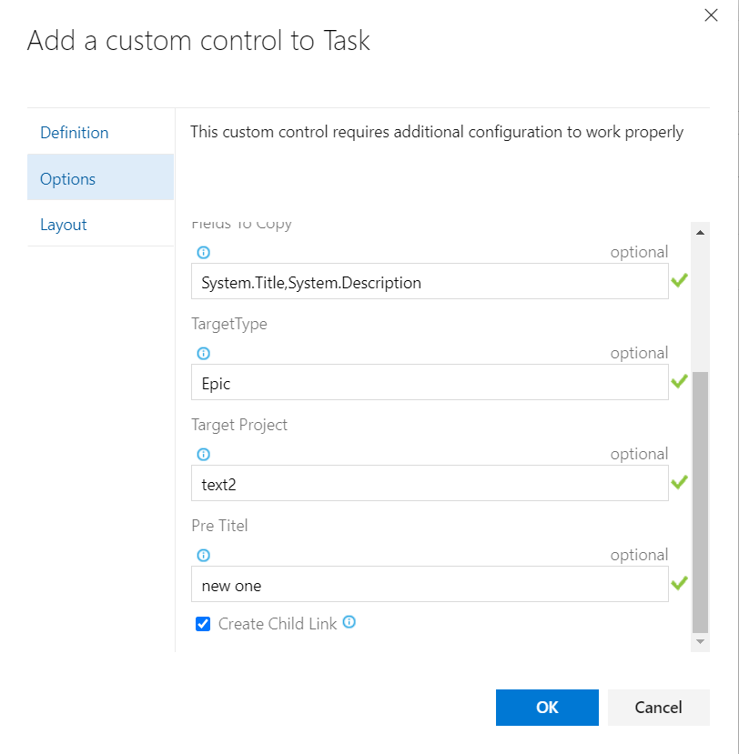

# Make Azure DevOps more interactive

# Triger an Action with a single click

Right now there is only one action, the 'convert work item', it copy the work item Basic fields to new and difrent work item

# How to get started

this can give you the option to add several button to your form.
and give each button the functionality you need. (from the given list)

## Variablel
* Buttons names         - List of button name (text) seperated by "," sign.
* Actions names         - List of Action names (from the given option) seperated by "," must be for each button name a function
* Fields To Copy        - List of fields refnames (seperated by ",") that need to be copy
* Work Item Target Type - Pass the new work item type neede (default uses the same work item type)
* Target Project Name   - Pass the new project name (default uses the same project)
* Pre Title             - Pass the text you want to add/set to the new work item
* Create Child Link     - Mark if you want to create link with the new work item as a child
## Configuration

# Source code 

The [source](https://github.com/avih75/Action_Button_Control.git) 
this extension can be found on Github - feel free to take, fork and extend. 

You can also learn how to build your own custom control extension for the work item form [here](https://www.visualstudio.com/en-us/docs/integrate/extensions/develop/custom-control). 

# Feedback 

* You can mail me for any Help.
* I need your feedback! 
* Add a review below.
* Report issues in [GitHub](https://github.com/avih75/Action_Button_Control.git) 

> Microsoft DevLabs is an outlet for experiments from Microsoft, experiments that represent some of the latest ideas around developer tools. Solutions in this category are designed for broad usage, and you are encouraged to use and provide feedback on them; however, these extensions are not supported nor are any commitments made as to their longevity.
