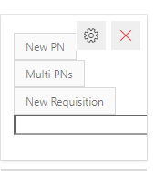
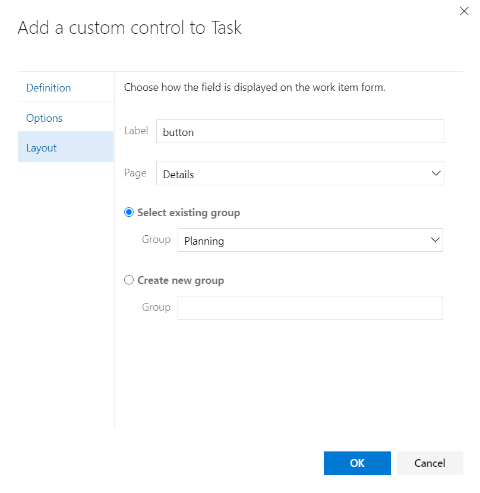
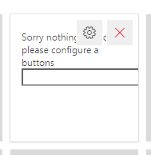
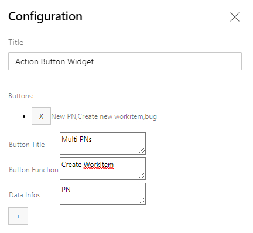

# Make Azure DevOps more interactive

# Triger an Action with a single click

Right now there is only one action, the 'convert work item', it copy the work item Basic fields to new and difrent work item

# How to get started

this can give you the option to add several button to your form.
and give each button the functionality you need. (from the given list)

## WorkItem - Action Button 

### Variablel
* Buttons names         - List of button name (text) seperated by "," sign.
* Actions names         - List of Action names (from the given option) seperated by "," must be for each button name a function
* Fields To Copy        - List of fields refnames (seperated by ",") that need to be copy
* Work Item Target Types- Pass the new work item type neede (default uses the same work item type)
* Target Project Name   - Pass the new project name (default uses the same project)
* Pre Titles            - Pass the text you want to add/set to the new work item (list by ,)
* Create Child Link     - Mark if you want to create link with the new work item as a child

To get your corect field refname open you browser and brows to : http://{ServerURL}/{CollectionName}/{ProjectName}/_apis/wit/fields
it will return the full work items fields list with all the properties
find your field and get the full refname.
### Configuration

## Dashboard - Action Button

### Variable

* Button Title    - the content of the button
* Button Function - the action function you want to use
* Data Infos      - data you want to pass to the action

	- "Create Work Item" 	- action open new work item, the data field represent the work itm type
	- "Create Requisition" 	- action open new work item name Requsition, the data contains list of wits names seperated with ',' to link to it.
	- "Open URL"			- action open new browser tab and the data is the url address
	- "+"                   - add the button
	- "-"					- remove a button
### Configuration

 

# Source code 

The [source](https://github.com/avih75/Action_Button_Control.git) 
to this extension can be found on Github - feel free to take, fork and extend. 

You can also learn how to build your own custom control extension for the work item form [here](https://www.visualstudio.com/en-us/docs/integrate/extensions/develop/custom-control). 

# Feedback 

* You can mail me for any Help.
* I need your feedback! 
* Add a review below.
* Report issues in [GitHub](https://github.com/avih75/Action_Button_Control.git) 

> Microsoft DevLabs is an outlet for experiments from Microsoft, experiments that represent some of the latest ideas around developer tools. Solutions in this category are designed for broad usage, and you are encouraged to use and provide feedback on them; however, these extensions are not supported nor are any commitments made as to their longevity.
